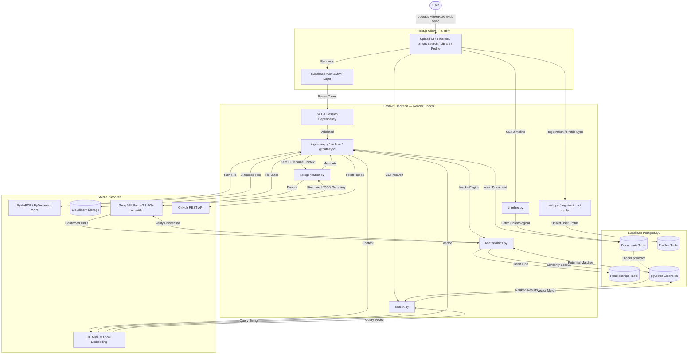

# Architecture Overview

## Data Flow Diagram

## Step-by-Step Flow

When a user interacts with the application, their request is routed through a modern decoupled pipeline:

1. **Authentication & Profile Registration:** All requests from the Next.js client hit Supabase Auth & JWT validation first. When a user creates an account, their **Full Name** and email are saved into `auth.users` metadata and synced to the `profiles` table via `/api/auth/register`. Authentication redirects (OAuth & email confirmation) use dynamic origin resolution (`NEXT_PUBLIC_SITE_URL` / `window.location.origin`) targeting the canonical Netlify domain (`https://memory-verse-ai.netlify.app`).
2. **Dynamic Onboarding & On-Screen Notifications:** 
   - First-time registrations trigger a **"Congratulations, [User Name]!"** modal.
   - Returning user logins trigger a **"Welcome Back, [User Name]!"** modal.
   - Clicking "Continue with Google" shows an interactive **"Google Login is coming soon!"** toast notification.
3. **Direct File Ingestion & Auto-Fill (`ingestion.py`):** Dropping a file automatically uses the filename as title for instant archive creation. PyMuPDF / PyTesseract extracts raw text, uploads source assets to **Cloudinary**, and saves document metadata into **Supabase**.
4. **Categorization & Structuring (`categorization.py`):** The raw text is processed by `categorization.py` using **Groq LLM** (`llama-3.3-70b-versatile` with fallbacks) to determine category pills (*Projects, Skills, Certifications, Internships, Achievements, Academics*) and event dates.
5. **Vector Embeddings (`embeddings.py`):** Processed document text is run through a local HuggingFace `sentence-transformer` model (`all-MiniLM-L6-v2`) to generate a 384-dimensional semantic embedding vector. The model is lazy-loaded on demand to keep container memory under 120 MB on Render.
6. **Relationship Engine (`relationships.py`):** Once saved in Supabase, `relationships.py` performs a similarity search using `pgvector`. It feeds potential matches to Groq for logical verification. Confirmed connections are indexed into the `relationships` table.
7. **Retrieval (`timeline.py` & `search.py`):** The Next.js frontend fetches processed data via `timeline.py` (chronological sorting) and `search.py` (cosine-similarity matching against `pgvector`).

## Why These Choices?

- **Supabase + pgvector (vs. separate vector database):** Combines standard relational data (document metadata, user profiles) alongside vector embeddings in a single PostgreSQL instance.
- **Groq `llama-3.3-70b-versatile` (vs. OpenAI/Anthropic):** Groq's ultra-fast LPU inference endpoints deliver sub-second JSON generation for instant document categorization and relationship verification.
- **Local Lazy Embeddings (MiniLM) (vs. API embeddings):** Generates 384D embeddings locally via HuggingFace `sentence-transformers`, lazy-loaded on demand to fit within Render Free Tier RAM limits (512 MB).

