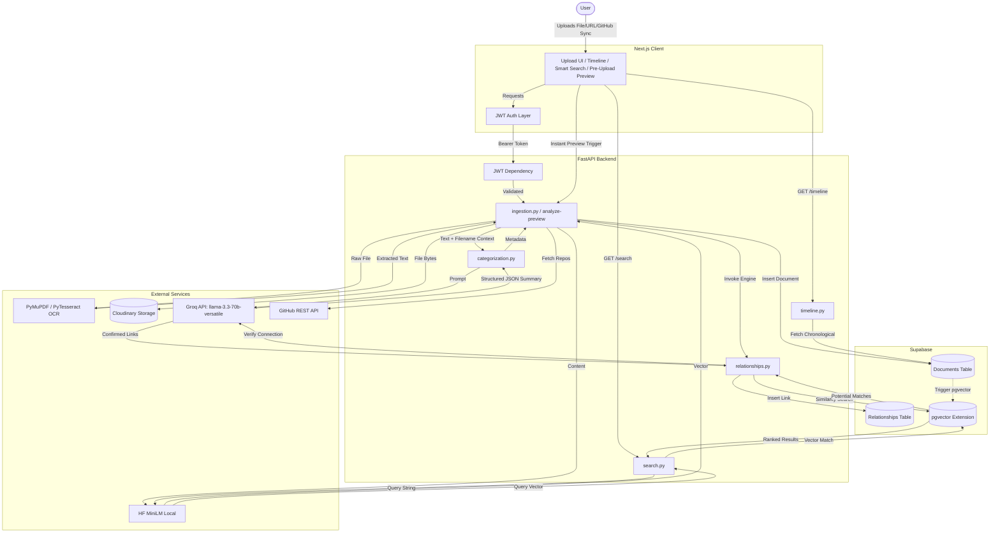

# Architecture Overview

## Data Flow Diagram

## Step-by-Step Flow

When a user interacts with the application, their request is routed through a modern decoupled pipeline:

1. **Authentication:** All requests from the Next.js client hit the JWT Auth layer first. The FastAPI backend validates this token globally to ensure endpoints are gated and user data remains isolated. Authentication redirects (OAuth & magic link) use dynamic origin resolution (`NEXT_PUBLIC_SITE_URL` / `window.location.origin`) to avoid invalid preview deployment redirects.
2. **Pre-Upload AI Auto-Detect (`analyze-preview`):** Dropping a file or link triggers `/api/documents/analyze-preview`. Text is extracted via `PyMuPDF` / `PyTesseract`, combined with filename context, and sent to **Groq LLM** (`llama-3.3-70b-versatile`). The pre-upload drawer instantly pre-fills the **Summary Section**, Title, Category pills, and Event Date.
3. **Ingestion & Extraction (`ingestion.py`):** When the user submits "Add to Archive", `ingestion.py` uploads source assets to **Cloudinary** for permanent cloud storage (preserving PDF formats without `.pdf.pdf` extension bugs) and stores document metadata into **Supabase**.
4. **Categorization & Structuring (`categorization.py`):** The raw text and user pre-upload overrides are processed by `categorization.py`. If the user customized the summary, title, or category in the UI drawer, those overrides take priority over AI defaults.
5. **Vector Embeddings (`embeddings.py`):** The processed document text is run through a local HuggingFace `sentence-transformer` model (`all-MiniLM-L6-v2`) to generate a 384-dimensional semantic embedding vector. The model is lazy-loaded on demand to keep initial container memory under 120 MB.
6. **Relationship Engine (`relationships.py`):** Once saved in Supabase, `relationships.py` performs a similarity search using `pgvector`. It feeds potential matches to Groq for logical verification. Confirmed connections are indexed into the `relationships` table.
7. **Retrieval (`timeline.py` & `search.py`):** The Next.js frontend fetches processed data via `timeline.py` (chronological sorting) and `search.py` (cosine-similarity matching against `pgvector`).

## Why These Choices?

- **Supabase + pgvector (vs. separate vector database):** Combines standard relational data (document metadata, user IDs) alongside vector embeddings in a single PostgreSQL instance, avoiding synchronization overhead.
- **Groq `llama-3.3-70b-versatile` (vs. OpenAI/Anthropic):** Groq's ultra-fast LPU inference endpoints deliver sub-second JSON generation for instant pre-upload summary reading and relationship verification.
- **Local Lazy Embeddings (MiniLM) (vs. API embeddings):** Generates 384D embeddings locally via HuggingFace `sentence-transformers`, lazy-loaded on demand to fit within Render Free Tier RAM limits (512 MB).

